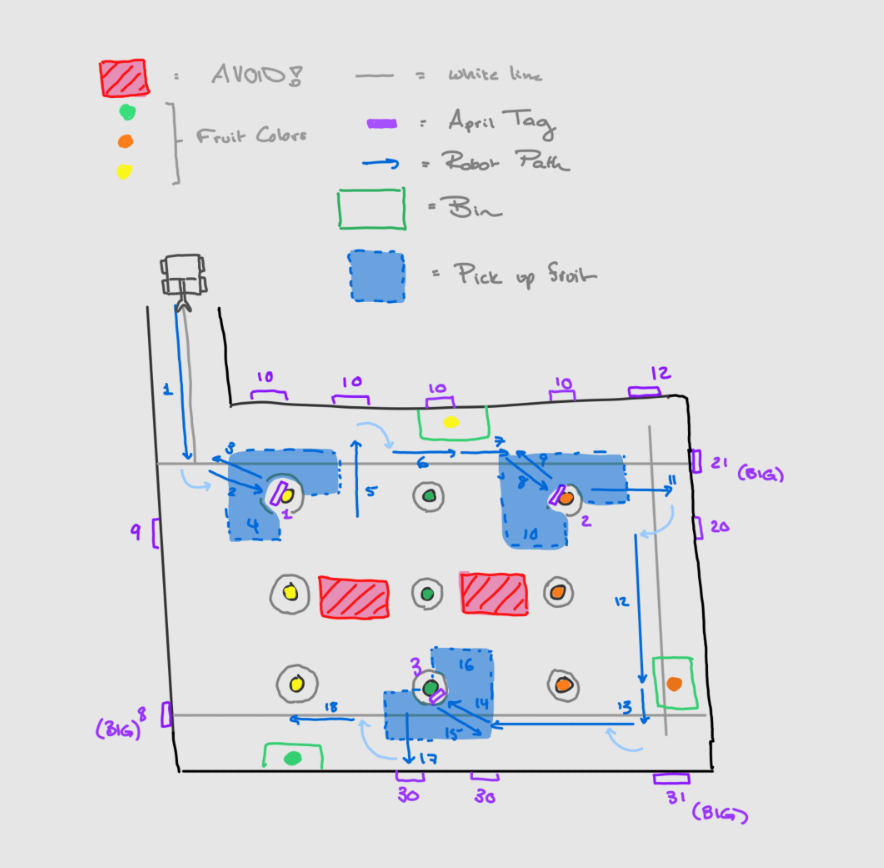

# Navigation Rough Draft

- I divided the navigation into three phases. Since we can place the bins anywhere on the field, I placed them along the path of the robot so that it can: 

        shake tree -> pick up fruit -> drop them off -> repeat

- I want to target the corner trees because the robot has a higher probablity of getting lost or something going wrong if its in the middle of the orchard. Targeting the corners trees increases the chance of having at least three fruit fall around the border of the map.
- I used aprils tags anywhere I could as they will most likely give us the most information about positioning and distance from the walls. One of the biggest challenges in terms of navigation will be finding my way back after picking up the fruit. Using aprils tags extensively might help the robot get back to the path smoothly

# TODO:
- Get robot to detect April Tags
- Get robot to follow line until certain distance from april tag
- Have robot start on ramp, go up, go around and end in front of **april tag 8**
- Get robot to shake tree and drop fruit; ***start with gripper closed around tree trunk***
- Get robot to identify closest fruit **on the floor**
- Get robot to pick up fruit
- Get robot to approach and grip tree
- Get robot to return to wall from any position; ***given view of april tag on the wall***

